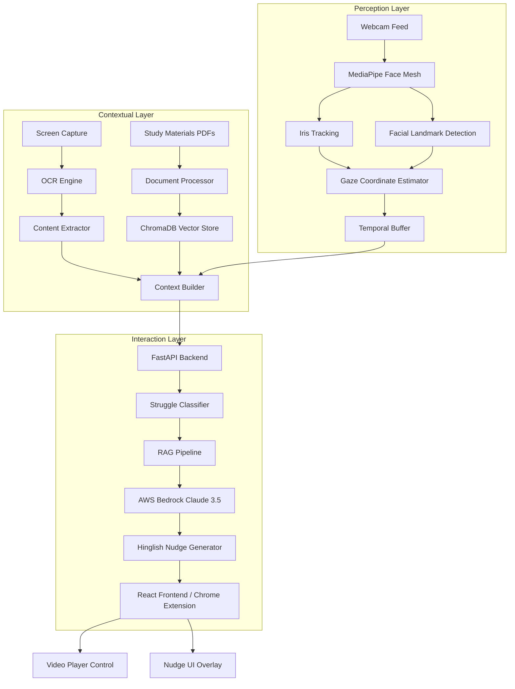
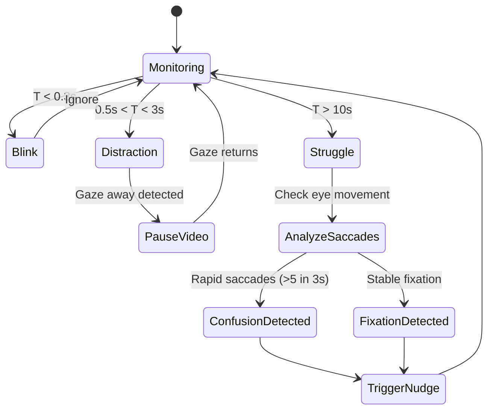
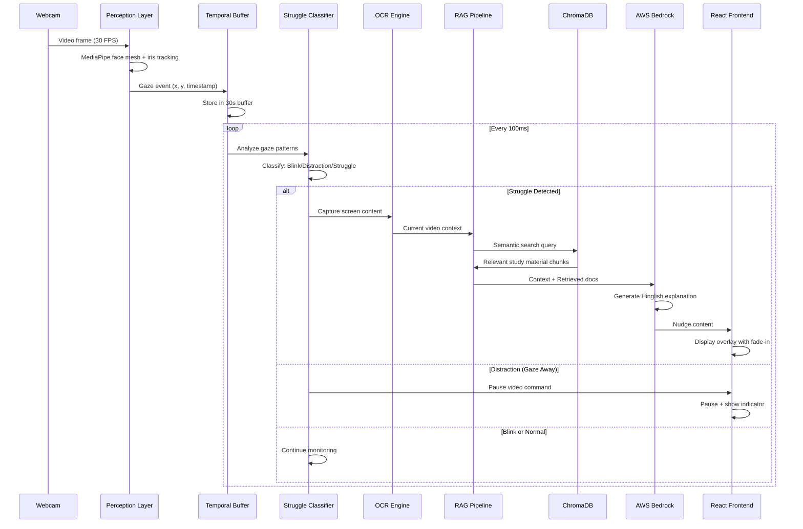
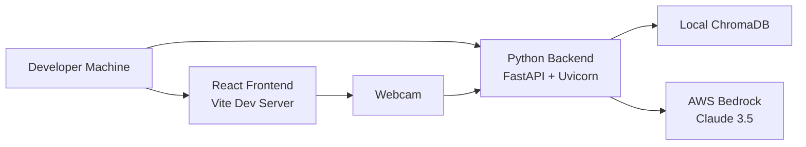
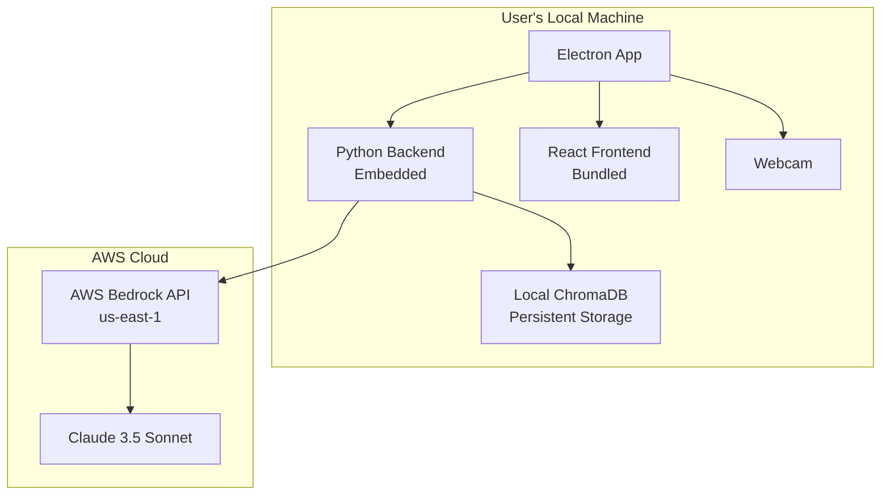

# Technical Design Document: A-Quire

## Overview

A-Quire is an AI-powered study assistant that uses real-time gaze tracking to detect student struggle and provide proactive tutoring in colloquial Hinglish. The system employs a 3-layer architecture: Perception Layer (MediaPipe-based gaze tracking), Contextual Layer (RAG with local study materials), and Interaction Layer (FastAPI backend with AWS Bedrock Claude 3.5 Sonnet).

The core innovation lies in the Struggle Detection Algorithm, which differentiates between physiological blinks (T < 0.3s), distractions (0.5s < T < 3s), and genuine conceptual struggle (T > 10s) using temporal buffer analysis and saccade vs. fixation patterns.

## System Architecture

### 3-Layer Architecture



### Layer Responsibilities

#### Perception Layer
- **Purpose**: Capture and process raw gaze data with minimal latency
- **Components**:
  - MediaPipe Face Mesh: 468-point facial landmark detection
  - Iris Tracking: Precise pupil center localization
  - Gaze Coordinate Estimator: Maps 3D eye orientation to 2D screen coordinates
  - Temporal Buffer: Stores last 30 seconds of gaze events for pattern analysis
- **Performance Target**: < 100ms processing latency per frame
- **Privacy**: All processing occurs locally, no data transmission

#### Contextual Layer
- **Purpose**: Build semantic understanding of study context
- **Components**:
  - OCR Engine: Extracts text from video frames and screen content
  - Document Processor: Chunks and embeds study materials
  - ChromaDB Vector Store: Stores embeddings for semantic search
  - Context Builder: Combines gaze patterns, screen content, and relevant documents
- **Performance Target**: < 1s for RAG retrieval
- **Storage**: Local vector database, no cloud storage of study materials

#### Interaction Layer
- **Purpose**: Generate and deliver contextual tutoring
- **Components**:
  - FastAPI Backend: Orchestrates struggle detection and AI tutoring
  - Struggle Classifier: Implements temporal analysis algorithm
  - RAG Pipeline: Retrieves relevant study material passages
  - AWS Bedrock Claude 3.5: Generates Hinglish explanations
  - React Frontend: Renders video player and nudge UI
- **Performance Target**: < 5s end-to-end from struggle detection to nudge display

## Struggle Detection Algorithm

### Temporal Classification Logic

The algorithm classifies gaze events based on temporal duration and spatial patterns:

```python
# Temporal thresholds
T_BLINK = 0.3      # seconds
T_DISTRACTION_MIN = 0.5
T_DISTRACTION_MAX = 3.0
T_STRUGGLE = 10.0   # seconds

# Spatial thresholds
FIXATION_RADIUS = 50  # pixels
SACCADE_VELOCITY_THRESHOLD = 300  # pixels/second
```

### Event Classification



### Saccades vs. Fixation Analysis

**Fixation Detection** (Indicates deep concentration on difficult content):
- Gaze remains within FIXATION_RADIUS (50 pixels) for duration T
- Low velocity: < 30 pixels/second
- Interpretation: Student is stuck on specific content
- Action: Trigger contextual explanation of current content

**Saccade Detection** (Indicates confusion or search behavior):
- Rapid eye movements between regions
- High velocity: > 300 pixels/second
- Pattern: > 5 saccades within 3 seconds
- Interpretation: Student is searching for related information
- Action: Trigger broader conceptual explanation

### Temporal Buffer Implementation

```python
class TemporalBuffer:
    """
    Stores gaze events with timestamps for pattern analysis.
    Buffer size: 30 seconds of history at 30 FPS = 900 frames
    """
    def __init__(self, buffer_duration=30.0, fps=30):
        self.buffer_duration = buffer_duration
        self.fps = fps
        self.max_frames = int(buffer_duration * fps)
        self.events = deque(maxlen=self.max_frames)
    
    def add_event(self, timestamp, gaze_x, gaze_y, event_type):
        """Add gaze event to buffer"""
        self.events.append({
            'timestamp': timestamp,
            'x': gaze_x,
            'y': gaze_y,
            'type': event_type
        })
    
    def detect_fixation(self, duration_threshold=10.0):
        """
        Detect if gaze has been fixated on same region
        for duration exceeding threshold
        """
        if len(self.events) < 2:
            return False, None
        
        current_time = self.events[-1]['timestamp']
        fixation_start = None
        fixation_point = None
        
        for event in reversed(self.events):
            time_diff = current_time - event['timestamp']
            if time_diff > duration_threshold:
                break
            
            if fixation_start is None:
                fixation_start = event
                fixation_point = (event['x'], event['y'])
                continue
            
            # Check if within fixation radius
            distance = math.sqrt(
                (event['x'] - fixation_point[0])**2 + 
                (event['y'] - fixation_point[1])**2
            )
            
            if distance > FIXATION_RADIUS:
                return False, None
        
        if fixation_start and (current_time - fixation_start['timestamp']) >= duration_threshold:
            return True, fixation_point
        
        return False, None
    
    def detect_saccades(self, time_window=3.0, min_saccades=5):
        """
        Detect rapid saccadic eye movements indicating confusion
        """
        if len(self.events) < 2:
            return False
        
        current_time = self.events[-1]['timestamp']
        saccade_count = 0
        prev_event = None
        
        for event in reversed(self.events):
            time_diff = current_time - event['timestamp']
            if time_diff > time_window:
                break
            
            if prev_event is not None:
                # Calculate velocity
                distance = math.sqrt(
                    (event['x'] - prev_event['x'])**2 + 
                    (event['y'] - prev_event['y'])**2
                )
                time_delta = prev_event['timestamp'] - event['timestamp']
                velocity = distance / time_delta if time_delta > 0 else 0
                
                if velocity > SACCADE_VELOCITY_THRESHOLD:
                    saccade_count += 1
            
            prev_event = event
        
        return saccade_count >= min_saccades
```

### Blink Detection and Filtering

```python
def is_physiological_blink(eye_closure_duration):
    """
    Filter out natural blinks from struggle detection
    """
    return eye_closure_duration < T_BLINK

def classify_gaze_event(temporal_buffer, current_event):
    """
    Main classification function
    """
    # Check for blink
    if current_event['type'] == 'eye_closed':
        if current_event['duration'] < T_BLINK:
            return 'BLINK_IGNORE'
    
    # Check for gaze away (distraction)
    if current_event['type'] == 'gaze_away':
        if T_DISTRACTION_MIN < current_event['duration'] < T_DISTRACTION_MAX:
            return 'DISTRACTION_PAUSE_VIDEO'
    
    # Check for struggle patterns
    is_fixated, fixation_point = temporal_buffer.detect_fixation(T_STRUGGLE)
    has_saccades = temporal_buffer.detect_saccades()
    
    if is_fixated:
        return 'STRUGGLE_FIXATION', fixation_point
    elif has_saccades:
        return 'STRUGGLE_CONFUSION', None
    
    return 'NORMAL', None
```

## Tech Stack

### Frontend
- **React 18**: UI framework for video player and nudge overlay
- **Chrome Extension**: Browser integration for web-based video platforms
- **Tailwind CSS**: Styling for empathetic, non-intrusive UI
- **Video.js**: HTML5 video player with custom controls

### Backend
- **FastAPI**: Async Python web framework for low-latency API
- **Python 3.11+**: Core language for all processing
- **Uvicorn**: ASGI server for FastAPI

### Perception Layer
- **MediaPipe 0.10+**: Face mesh and iris tracking
- **OpenCV 4.8+**: Video capture and image processing
- **NumPy**: Numerical computations for gaze estimation

### Contextual Layer
- **ChromaDB**: Vector database for RAG
- **LangChain**: RAG pipeline orchestration
- **Sentence Transformers**: Text embedding (all-MiniLM-L6-v2)
- **PyMuPDF (fitz)**: PDF text extraction
- **Tesseract OCR**: Screen content extraction

### AI Layer
- **AWS Bedrock**: Claude 3.5 Sonnet API access
- **Boto3**: AWS SDK for Python
- **LangChain AWS Integration**: Bedrock LLM wrapper

### Data Storage
- **SQLite**: Local session history and bookmarks
- **ChromaDB**: Vector embeddings (local persistence)

### Development Tools
- **Poetry**: Dependency management
- **Pytest**: Testing framework
- **Black**: Code formatting
- **Ruff**: Linting

## Data Flow Diagram



### Detailed Data Flow Steps

1. **Gaze Capture** (Perception Layer):
   - Webcam captures frames at 30 FPS
   - MediaPipe processes each frame in < 33ms
   - Iris tracking provides pupil center coordinates
   - Facial landmarks provide head pose estimation
   - Gaze estimator combines iris + head pose → screen coordinates

2. **Temporal Analysis** (Contextual Layer):
   - Gaze events stored in circular buffer (30s history)
   - Every 100ms, Struggle Classifier analyzes buffer
   - Fixation detection: Check if gaze stayed in 50px radius for 10s
   - Saccade detection: Count rapid movements (>300 px/s) in last 3s

3. **Context Building** (Contextual Layer):
   - OCR extracts text from current video frame
   - Video timestamp and transcript retrieved
   - Context Builder creates semantic query

4. **RAG Retrieval** (Contextual Layer):
   - Query embedded using Sentence Transformers
   - ChromaDB performs cosine similarity search
   - Top 3 most relevant chunks retrieved (< 1s)

5. **AI Generation** (Interaction Layer):
   - LangChain constructs prompt with:
     - System persona (Hinglish tutor)
     - Current video context
     - Retrieved study material passages
     - Struggle type (fixation vs. confusion)
   - AWS Bedrock Claude 3.5 generates response (2-3s)

6. **Nudge Display** (Interaction Layer):
   - React frontend receives nudge content
   - Overlay fades in over 300ms
   - Positioned in bottom-right corner
   - User can dismiss, bookmark, or request more detail

## Components and Interfaces

### Gaze Tracker Component

```python
class GazeTracker:
    """
    Perception Layer: Real-time gaze tracking using MediaPipe
    """
    def __init__(self, camera_id=0):
        self.camera_id = camera_id
        self.face_mesh = mp.solutions.face_mesh.FaceMesh(
            max_num_faces=1,
            refine_landmarks=True,
            min_detection_confidence=0.5,
            min_tracking_confidence=0.5
        )
        self.cap = cv2.VideoCapture(camera_id)
        self.calibration_data = None
    
    def calibrate(self, calibration_points):
        """
        5-point calibration: corners + center
        Returns calibration matrix for gaze mapping
        """
        pass
    
    def estimate_gaze(self, frame):
        """
        Returns: (gaze_x, gaze_y, confidence, is_blink)
        Processing time: < 33ms per frame
        """
        pass
    
    def get_iris_landmarks(self, face_landmarks):
        """
        Extract iris center from MediaPipe landmarks
        Iris landmarks: 468-478 (left), 473-483 (right)
        """
        pass
    
    def estimate_head_pose(self, face_landmarks):
        """
        Calculate head rotation (pitch, yaw, roll)
        Used to adjust gaze estimation
        """
        pass
```

### Struggle Detector Component

```python
class StruggleDetector:
    """
    Contextual Layer: Analyzes gaze patterns to detect struggle
    """
    def __init__(self):
        self.temporal_buffer = TemporalBuffer(duration=30.0)
        self.last_struggle_time = 0
        self.struggle_cooldown = 60.0  # Don't trigger again for 60s
    
    def process_gaze_event(self, gaze_x, gaze_y, timestamp):
        """
        Add event to buffer and check for struggle patterns
        Returns: (event_type, metadata)
        """
        pass
    
    def should_trigger_nudge(self, current_time):
        """
        Check cooldown period to avoid nudge fatigue
        """
        return (current_time - self.last_struggle_time) > self.struggle_cooldown
```

### RAG Engine Component

```python
class RAGEngine:
    """
    Contextual Layer: Retrieval-Augmented Generation pipeline
    """
    def __init__(self, chroma_persist_dir="./chroma_db"):
        self.embeddings = SentenceTransformerEmbeddings(
            model_name="all-MiniLM-L6-v2"
        )
        self.vectorstore = Chroma(
            persist_directory=chroma_persist_dir,
            embedding_function=self.embeddings
        )
        self.text_splitter = RecursiveCharacterTextSplitter(
            chunk_size=500,
            chunk_overlap=50
        )
    
    def index_document(self, pdf_path):
        """
        Extract text from PDF, chunk, embed, and store in ChromaDB
        Processing time: ~30s per document
        """
        pass
    
    def retrieve_context(self, query, k=3):
        """
        Semantic search for relevant passages
        Returns: List of (text, metadata, score)
        Processing time: < 1s
        """
        pass
```

### AI Tutor Component

```python
class AITutor:
    """
    Interaction Layer: Generates Hinglish explanations using AWS Bedrock
    """
    def __init__(self):
        self.bedrock_client = boto3.client(
            service_name='bedrock-runtime',
            region_name='us-east-1'
        )
        self.model_id = "anthropic.claude-3-5-sonnet-20241022-v2:0"
        self.system_persona = self._load_system_persona()
    
    def generate_nudge(self, context, retrieved_docs, struggle_type):
        """
        Generate Hinglish explanation
        Args:
            context: Current video content and timestamp
            retrieved_docs: Relevant passages from study materials
            struggle_type: 'fixation' or 'confusion'
        Returns: Hinglish nudge text
        Processing time: 2-3s
        """
        pass
    
    def _load_system_persona(self):
        """
        Load system prompt for Hinglish tutor persona
        """
        return HINGLISH_TUTOR_PERSONA
```

### Video Player Controller

```python
class VideoPlayerController:
    """
    Interaction Layer: Controls video playback based on gaze events
    """
    def __init__(self, video_element_id):
        self.video_element_id = video_element_id
        self.is_auto_paused = False
        self.manual_pause = False
    
    def pause_for_gaze_away(self):
        """
        Pause video when user looks away
        Latency: < 100ms
        """
        pass
    
    def resume_on_gaze_return(self):
        """
        Resume video when user looks back
        Latency: < 100ms
        """
        pass
    
    def disable_auto_pause(self):
        """
        Disable auto-pause when user manually pauses
        """
        pass
```

## Data Models

### Gaze Event Model

```python
from dataclasses import dataclass
from typing import Literal

@dataclass
class GazeEvent:
    timestamp: float
    gaze_x: int
    gaze_y: int
    confidence: float
    event_type: Literal['fixation', 'saccade', 'blink', 'gaze_away']
    duration: float
    metadata: dict
```

### Struggle Event Model

```python
@dataclass
class StruggleEvent:
    timestamp: float
    video_timestamp: float
    struggle_type: Literal['fixation', 'confusion']
    fixation_point: tuple[int, int] | None
    saccade_count: int
    context: str
    triggered_nudge: bool
```

### Study Material Chunk Model

```python
@dataclass
class StudyMaterialChunk:
    chunk_id: str
    document_name: str
    page_number: int
    text: str
    embedding: list[float]
    metadata: dict
```

### Nudge Model

```python
@dataclass
class Nudge:
    nudge_id: str
    timestamp: float
    video_timestamp: float
    content: str
    language: Literal['hinglish']
    retrieved_sources: list[str]
    user_action: Literal['dismissed', 'bookmarked', 'expanded', None]
    display_duration: float
```

### Session Model

```python
@dataclass
class StudySession:
    session_id: str
    start_time: float
    end_time: float
    video_url: str
    total_struggle_events: int
    total_nudges_shown: int
    nudges_dismissed: int
    struggle_timestamps: list[float]
    bookmarks: list[dict]
```

## Prompt Engineering Strategy

### System Persona for Claude 3.5 Sonnet

The AI Tutor uses a carefully crafted system persona to ensure natural Hinglish output that feels supportive rather than condescending.

```python
HINGLISH_TUTOR_PERSONA = """
You are a friendly senior student helping a junior understand complex concepts. You speak in colloquial urban Hinglish - a natural mix of Hindi and English that Indian students use daily.

PERSONALITY:
- Supportive and encouraging, never condescending
- Use casual language like "dekh", "samajh", "basically", "matlab"
- Avoid formal English or overly technical jargon unless necessary
- Think of yourself as a helpful bhaiya/didi, not a strict teacher

LANGUAGE STYLE:
- Mix Hindi and English naturally (e.g., "Dekh, basically yeh concept simple hai")
- Use Hindi for connectors: "toh", "aur", "lekin", "kyunki"
- Use English for technical terms: "algorithm", "function", "variable"
- Keep sentences short and conversational
- Use examples from everyday life when possible

TONE:
- Warm and patient
- Acknowledge that concepts can be tricky: "Haan, yeh thoda confusing lag sakta hai"
- Celebrate understanding: "Exactly! Ab samajh aa gaya na?"
- Never say "You seem confused" or "Let me help you" - too formal

EXPLANATION STRUCTURE:
1. Acknowledge the difficulty briefly (1 sentence)
2. Give a simple analogy or example (2-3 sentences)
3. Connect to the study material if available (1-2 sentences)
4. End with encouragement (1 sentence)

EXAMPLE OUTPUT:
"Arre dekh, pointers thoda tricky hai initially. Basically, think of it like a phone number - number khud toh sirf digits hai, but usse tu kisi ko call kar sakta hai, right? Tere notes mein bhi likha hai ki pointer ek address store karta hai. Bas yeh samajh le, aur baaki sab clear ho jayega!"

Remember: You're not a formal tutor, you're a helpful friend explaining things over chai.
"""
```

### Prompt Template for Struggle Fixation

```python
FIXATION_PROMPT_TEMPLATE = """
{system_persona}

CONTEXT:
The student has been staring at this content for {duration} seconds, indicating they're stuck:

VIDEO CONTENT:
{video_context}

RELEVANT STUDY MATERIAL:
{retrieved_docs}

TASK:
The student seems stuck on this specific concept. Give a brief, friendly Hinglish explanation that:
1. Acknowledges this part is tricky
2. Breaks down the concept simply
3. References their study material if relevant
4. Keeps it under 100 words

Remember: Natural Hinglish, supportive tone, no condescension.
"""
```

### Prompt Template for Confusion (Saccades)

```python
CONFUSION_PROMPT_TEMPLATE = """
{system_persona}

CONTEXT:
The student's eyes are moving rapidly between different parts of the screen ({saccade_count} rapid movements in 3 seconds), suggesting they're trying to connect concepts but feeling confused.

VIDEO CONTENT:
{video_context}

RELEVANT STUDY MATERIAL:
{retrieved_docs}

TASK:
The student is trying to connect multiple concepts but seems confused. Give a brief Hinglish explanation that:
1. Acknowledges they're trying to connect things (positive!)
2. Shows how the concepts relate to each other
3. Uses their study material to clarify
4. Keeps it under 100 words

Remember: Natural Hinglish, encouraging tone, help them see the connections.
"""
```

### Example Prompt Execution

**Input Context:**
- Duration: 12 seconds fixation
- Video content: "Deadlock occurs when two processes wait for each other's resources"
- Retrieved doc: "Deadlock conditions: Mutual exclusion, Hold and wait, No preemption, Circular wait"

**Generated Nudge:**
```
Arre haan, deadlock thoda confusing hai initially. Dekh, imagine do dost hain - ek ke paas pen hai aur doosre ke paas notebook. Dono bol rahe hain "pehle tu de, phir main dunga". Bas yahi deadlock hai! Tere notes mein bhi likha hai ki circular wait hona chahiye. Toh basically, processes ek doosre ka wait kar rahe hain aur koi aage nahi badh sakta. Simple hai na?
```

### Prompt Optimization Strategies

1. **Context Window Management**:
   - Limit retrieved docs to top 3 chunks (< 1500 tokens)
   - Truncate video context to last 30 seconds of transcript
   - Keep system persona under 500 tokens

2. **Temperature Settings**:
   - Temperature: 0.7 (balance between creativity and consistency)
   - Top-p: 0.9 (allow natural language variation)
   - Max tokens: 150 (enforce brevity)

3. **Few-Shot Examples**:
   - Include 2-3 example Hinglish explanations in system prompt
   - Show both fixation and confusion scenarios
   - Demonstrate proper Hindi-English code-switching

4. **Feedback Loop**:
   - Track nudge dismissal rates per explanation style
   - A/B test different persona variations
   - Adjust formality based on user preferences

## Error Handling

### Gaze Tracking Errors

```python
class GazeTrackingError(Exception):
    """Base exception for gaze tracking failures"""
    pass

class CameraNotFoundError(GazeTrackingError):
    """Webcam not detected or accessible"""
    pass

class CalibrationFailedError(GazeTrackingError):
    """Calibration accuracy below threshold"""
    pass

class FaceNotDetectedError(GazeTrackingError):
    """No face detected in frame for > 2 seconds"""
    pass

# Error handling strategy
def handle_gaze_error(error):
    if isinstance(error, CameraNotFoundError):
        # Show UI message: "Please connect webcam"
        # Disable gaze features, allow manual video control
        pass
    elif isinstance(error, FaceNotDetectedError):
        # Pause video
        # Show UI message: "Please position yourself in front of camera"
        # Attempt reconnection every 1 second
        pass
    elif isinstance(error, CalibrationFailedError):
        # Prompt user to adjust lighting/camera position
        # Retry calibration up to 3 times
        # Fall back to reduced accuracy mode
        pass
```

### RAG Pipeline Errors

```python
class RAGError(Exception):
    """Base exception for RAG pipeline failures"""
    pass

class DocumentIndexingError(RAGError):
    """Failed to process and index document"""
    pass

class RetrievalError(RAGError):
    """Failed to retrieve relevant context"""
    pass

# Error handling strategy
def handle_rag_error(error, context):
    if isinstance(error, DocumentIndexingError):
        # Log error, notify user which document failed
        # Continue with other successfully indexed documents
        pass
    elif isinstance(error, RetrievalError):
        # Fall back to AI generation without retrieved context
        # Use only video context for explanation
        # Log retrieval failure for debugging
        pass
```

### AWS Bedrock Errors

```python
class AITutorError(Exception):
    """Base exception for AI tutor failures"""
    pass

class BedrockAPIError(AITutorError):
    """AWS Bedrock API call failed"""
    pass

class RateLimitError(AITutorError):
    """API rate limit exceeded"""
    pass

# Error handling strategy
def handle_ai_error(error, retry_count=0):
    if isinstance(error, RateLimitError):
        # Implement exponential backoff
        # Queue nudge for retry after cooldown
        # Show user: "Generating explanation..."
        pass
    elif isinstance(error, BedrockAPIError):
        if retry_count < 3:
            # Retry with exponential backoff
            time.sleep(2 ** retry_count)
            return retry_ai_generation()
        else:
            # Fall back to template-based explanation
            # Log failure for monitoring
            pass
```

### Video Player Errors

```python
class VideoPlayerError(Exception):
    """Base exception for video player failures"""
    pass

class VideoLoadError(VideoPlayerError):
    """Failed to load video file"""
    pass

class PlaybackError(VideoPlayerError):
    """Error during video playback"""
    pass

# Error handling strategy
def handle_video_error(error):
    if isinstance(error, VideoLoadError):
        # Show user-friendly error message
        # Suggest checking file format/codec
        # Disable gaze features until video loads
        pass
    elif isinstance(error, PlaybackError):
        # Attempt to resume from last known position
        # If fails, reload video
        # Preserve session data and bookmarks
        pass
```

## Testing Strategy

### Unit Testing

**Perception Layer Tests**:
- Test gaze coordinate estimation accuracy (< 50px error)
- Test blink detection (< 0.3s classification)
- Test calibration matrix computation
- Test head pose estimation

**Contextual Layer Tests**:
- Test temporal buffer operations (add, retrieve, analyze)
- Test fixation detection algorithm
- Test saccade counting algorithm
- Test RAG retrieval accuracy (relevance scoring)
- Test document chunking and embedding

**Interaction Layer Tests**:
- Test video pause/resume latency (< 100ms)
- Test nudge UI rendering and positioning
- Test session data persistence
- Test bookmark creation and retrieval

### Property-Based Testing

A property is a characteristic or behavior that should hold true across all valid executions of a system - essentially, a formal statement about what the system should do. Properties serve as the bridge between human-readable specifications and machine-verifiable correctness guarantees.

Before writing correctness properties, I need to analyze the acceptance criteria from the requirements document to determine which are testable as properties.


#### Property 1: Gaze-triggered video control latency
*For any* gaze away event lasting more than 0.5 seconds, the video player should pause within 100 milliseconds, and for any gaze return event, the video player should resume within 100 milliseconds.
**Validates: Requirements 1.1, 1.2**

#### Property 2: Auto-pause visual feedback
*For any* video pause triggered by gaze away detection, a visual indicator showing the pause reason should be displayed in the UI.
**Validates: Requirements 1.3**

#### Property 3: Blink filtering
*For any* physiological blink (duration < 0.3 seconds), the video player should continue playback without interruption and the struggle detector should not classify it as a struggle indicator.
**Validates: Requirements 1.4, 3.2**

#### Property 4: Manual pause disables auto-pause
*For any* manual pause action by the user, automatic pause functionality should be disabled until the user manually resumes playback.
**Validates: Requirements 1.5**

#### Property 5: Gaze coordinate accuracy
*For any* detected eye position with known ground truth, the gaze coordinates should be accurate within 50 pixels of the actual gaze point.
**Validates: Requirements 2.3**

#### Property 6: Eye detection failure handling
*For any* eye detection failure lasting more than 2 seconds, the system should pause the video and display a reconnection message.
**Validates: Requirements 2.5**

#### Property 7: Fixation classification
*For any* continuous gaze fixation on the same video region (within 50 pixel radius) for more than 10 seconds, the struggle detector should classify this as a struggle fixation.
**Validates: Requirements 3.1**

#### Property 8: Saccade-based confusion detection
*For any* gaze sequence containing more than 5 rapid movements (velocity > 300 px/s) between video regions within 3 seconds, the struggle detector should classify this as confusion and trigger help.
**Validates: Requirements 3.4**

#### Property 9: Struggle event logging
*For any* struggle pattern identified by the struggle detector, the system should create a timestamped bookmark in the session history with video context.
**Validates: Requirements 3.5, 9.2**

#### Property 10: Nudge positioning
*For any* nudge displayed by the system, the overlay should be positioned such that it does not obstruct the video content area or subtitle region.
**Validates: Requirements 4.3, 8.2**

#### Property 11: Adaptive nudge frequency
*For any* sequence of 3 consecutive nudge dismissals within 5 minutes, the system should reduce nudge frequency by 50% for the next 30 minutes.
**Validates: Requirements 8.3**

#### Property 12: AI context inclusion
*For any* AI tutor request, the prompt should include relevant context from the current video timestamp and transcript.
**Validates: Requirements 4.5**

#### Property 13: RAG content incorporation
*For any* AI explanation where the RAG engine retrieves relevant passages from study materials, the explanation should incorporate direct quotes or references from those passages.
**Validates: Requirements 5.3**

#### Property 14: PDF processing capability
*For any* PDF file up to 50MB in size, the RAG engine should successfully extract text content while preserving formatting.
**Validates: Requirements 5.5**

#### Property 15: Privacy - no gaze data transmission
*For any* data transmitted to external servers (AWS Bedrock), the payload should not contain raw gaze coordinates, eye images, or any personally identifiable gaze tracking data.
**Validates: Requirements 6.2, 6.3**

#### Property 16: Memory cleanup on exit
*For any* application closure event, all temporary gaze tracking data should be deleted from memory.
**Validates: Requirements 6.5**

#### Property 17: Bookmark creation for "Explain Later"
*For any* "Explain Later" action on a nudge, the system should create a bookmark at the current video timestamp without interrupting playback.
**Validates: Requirements 8.5**

#### Property 18: Session summary generation
*For any* completed study session, the system should generate a summary containing total study time, struggle points, and topics covered.
**Validates: Requirements 9.1**

#### Property 19: Session export functionality
*For any* study session in history, the system should allow export as a PDF report containing all session data.
**Validates: Requirements 9.4**

#### Property 20: Bookmark navigation
*For any* struggle bookmark clicked by the user, the system should navigate to that video timestamp and display the associated AI-generated explanation.
**Validates: Requirements 9.5**

#### Property 21: Calibration validation
*For any* completed calibration sequence, the system should validate accuracy by testing gaze detection on known points.
**Validates: Requirements 10.3**

#### Property 22: Calibration retry on low accuracy
*For any* calibration result with accuracy below 80%, the system should prompt the user to adjust camera position and offer recalibration.
**Validates: Requirements 10.4**

#### Property 23: Calibration profile persistence
*For any* user calibration session, the calibration profile should be saved and automatically loaded in future sessions for that user.
**Validates: Requirements 10.5**

### Integration Testing

**End-to-End Scenarios**:
1. Complete study session flow:
   - Start application → Calibrate → Load video → Study with gaze tracking → Receive nudges → End session → Review summary
   - Verify all components work together seamlessly
   - Measure end-to-end latency from struggle detection to nudge display

2. RAG pipeline integration:
   - Upload study materials → Index documents → Trigger struggle → Verify retrieved content appears in nudge
   - Test with various document types and sizes
   - Verify semantic relevance of retrieved passages

3. Privacy compliance:
   - Monitor all network traffic during session
   - Verify no gaze data transmitted to external servers
   - Verify local processing of all sensitive data

4. Error recovery:
   - Simulate camera disconnection during session
   - Simulate AWS Bedrock API failures
   - Verify graceful degradation and recovery

**Performance Testing**:
- Gaze processing latency: Measure frame-by-frame processing time
- Video pause/resume latency: Measure time from gaze event to video state change
- RAG retrieval latency: Measure time from query to retrieved results
- AI generation latency: Measure time from API call to response
- End-to-end latency: Measure complete struggle-to-nudge pipeline

**Load Testing**:
- Long study sessions (2+ hours): Verify no memory leaks or performance degradation
- Large document collections (100+ PDFs): Verify RAG performance remains acceptable
- Rapid gaze events: Verify system handles high-frequency gaze data without dropping frames

### Testing Configuration

**Property-Based Testing Library**: Hypothesis (Python)

**Test Configuration**:
```python
from hypothesis import given, settings, strategies as st

# Configure Hypothesis for thorough testing
@settings(max_examples=100, deadline=None)
@given(
    gaze_x=st.integers(min_value=0, max_value=1920),
    gaze_y=st.integers(min_value=0, max_value=1080),
    duration=st.floats(min_value=0.0, max_value=30.0)
)
def test_property_1_gaze_triggered_video_control(gaze_x, gaze_y, duration):
    """
    Feature: a-quire, Property 1: Gaze-triggered video control latency
    
    For any gaze away event lasting more than 0.5 seconds, the video player 
    should pause within 100 milliseconds, and for any gaze return event, 
    the video player should resume within 100 milliseconds.
    """
    # Test implementation
    pass
```

**Unit Test Framework**: Pytest

**Integration Test Framework**: Pytest with pytest-asyncio for async testing

**Performance Test Framework**: Locust for load testing, pytest-benchmark for micro-benchmarks

## Deployment Architecture

### Local Development



### Production Deployment



**Deployment Strategy**:
- Package as Electron app for cross-platform desktop support
- Embed Python backend using PyInstaller
- Bundle React frontend with Webpack
- Include MediaPipe and OpenCV binaries
- Local ChromaDB for vector storage (no cloud database)
- Only external dependency: AWS Bedrock API

**Installation Requirements**:
- Operating System: Windows 10+, macOS 11+, Ubuntu 20.04+
- RAM: 8GB minimum, 16GB recommended
- Storage: 2GB for application + space for study materials
- Webcam: 720p minimum, 1080p recommended
- Internet: Required for AWS Bedrock API calls only

## Security Considerations

### Data Privacy

1. **Local Processing**:
   - All gaze tracking data processed locally via MediaPipe
   - No raw gaze coordinates transmitted to external servers
   - Study materials remain on user's device

2. **API Communication**:
   - Only anonymized struggle events sent to AWS Bedrock
   - No personally identifiable information in API requests
   - TLS encryption for all API communication

3. **Data Retention**:
   - Gaze data stored in memory only during active session
   - Automatic cleanup on application exit
   - Session history stored locally with user control

### Authentication and Authorization

1. **AWS Credentials**:
   - User provides own AWS credentials for Bedrock access
   - Credentials stored securely using OS keychain
   - No credentials transmitted to third parties

2. **User Data**:
   - No user accounts or authentication required
   - All data stored locally on user's device
   - User has full control over data deletion

### Threat Model

**Threats Mitigated**:
- Gaze data interception: All processing local, no transmission
- Study material exposure: All documents stored locally
- Session history leakage: Local storage only

**Threats Not Mitigated** (Out of Scope):
- Physical access to user's device
- Malware on user's device
- AWS Bedrock API compromise

## Performance Optimization

### Gaze Processing Optimization

1. **Frame Rate Adaptation**:
   - Dynamically adjust processing frame rate based on CPU load
   - Reduce to 15 FPS if CPU usage > 80%
   - Maintain 30 FPS under normal conditions

2. **Efficient Landmark Detection**:
   - Use MediaPipe's refine_landmarks only when needed
   - Cache face mesh results for consecutive frames
   - Skip processing if face hasn't moved significantly

3. **Temporal Buffer Optimization**:
   - Use circular buffer to avoid memory reallocation
   - Implement efficient spatial indexing for fixation detection
   - Prune old events beyond 30-second window

### RAG Pipeline Optimization

1. **Document Chunking**:
   - Optimal chunk size: 500 tokens with 50 token overlap
   - Pre-compute embeddings during indexing
   - Cache frequently accessed chunks

2. **Vector Search**:
   - Use HNSW index in ChromaDB for fast similarity search
   - Limit search to top 3 results for speed
   - Implement query caching for repeated searches

3. **Embedding Model**:
   - Use lightweight model: all-MiniLM-L6-v2 (80MB)
   - Batch embed multiple chunks for efficiency
   - Cache embeddings to avoid recomputation

### AI Generation Optimization

1. **Prompt Optimization**:
   - Keep prompts under 2000 tokens
   - Truncate retrieved context if too long
   - Use streaming responses for faster perceived latency

2. **Caching**:
   - Cache AI responses for similar struggle patterns
   - Implement semantic similarity check before API call
   - Reuse explanations for identical video timestamps

3. **Rate Limiting**:
   - Implement cooldown period (60s) between nudges
   - Queue multiple struggle events and batch process
   - Prioritize fixation over confusion events

## Monitoring and Observability

### Metrics to Track

1. **Performance Metrics**:
   - Gaze processing latency (p50, p95, p99)
   - Video pause/resume latency
   - RAG retrieval time
   - AI generation time
   - End-to-end struggle-to-nudge latency

2. **Usage Metrics**:
   - Study session duration
   - Struggle events per session
   - Nudges shown per session
   - Nudge dismissal rate
   - Bookmark creation rate

3. **Quality Metrics**:
   - Gaze tracking accuracy
   - Calibration success rate
   - RAG retrieval relevance (user feedback)
   - AI explanation helpfulness (user feedback)

### Logging Strategy

```python
import logging
from datetime import datetime

# Configure structured logging
logging.basicConfig(
    level=logging.INFO,
    format='%(asctime)s - %(name)s - %(levelname)s - %(message)s',
    handlers=[
        logging.FileHandler('aquire.log'),
        logging.StreamHandler()
    ]
)

# Log categories
logger_gaze = logging.getLogger('aquire.gaze')
logger_struggle = logging.getLogger('aquire.struggle')
logger_rag = logging.getLogger('aquire.rag')
logger_ai = logging.getLogger('aquire.ai')

# Example log entries
logger_gaze.info(f"Gaze event: x={gaze_x}, y={gaze_y}, confidence={confidence}")
logger_struggle.info(f"Struggle detected: type={struggle_type}, timestamp={video_ts}")
logger_rag.info(f"Retrieved {len(docs)} documents in {retrieval_time}ms")
logger_ai.info(f"Generated nudge in {generation_time}ms, tokens={token_count}")
```

### Error Tracking

- Log all exceptions with full stack traces
- Track error rates by component
- Alert on critical errors (camera failure, API errors)
- Provide user-friendly error messages in UI

## Future Enhancements

### Phase 2 Features

1. **Multi-Modal Struggle Detection**:
   - Add facial expression analysis (confusion, frustration)
   - Incorporate mouse/keyboard activity patterns
   - Combine multiple signals for higher accuracy

2. **Adaptive Learning**:
   - Learn user's struggle patterns over time
   - Personalize nudge timing and content
   - Adjust thresholds based on user feedback

3. **Collaborative Features**:
   - Share study sessions with peers
   - Collaborative note-taking
   - Group study mode with multiple users

4. **Mobile Support**:
   - iOS/Android apps with front camera tracking
   - Optimized UI for smaller screens
   - Offline mode with sync

5. **Advanced Analytics**:
   - Learning progress tracking over time
   - Concept mastery visualization
   - Personalized study recommendations

### Technical Debt to Address

1. **Testing Coverage**:
   - Increase unit test coverage to 90%+
   - Add more integration tests for edge cases
   - Implement visual regression testing for UI

2. **Performance**:
   - Profile and optimize hot paths
   - Reduce memory footprint
   - Improve startup time

3. **Code Quality**:
   - Refactor large functions into smaller units
   - Improve error handling consistency
   - Add more type hints and documentation

## Conclusion

A-Quire's 3-layer architecture provides a robust foundation for real-time struggle detection and proactive tutoring. The Perception Layer ensures privacy-first gaze tracking with low latency, the Contextual Layer builds rich semantic understanding through RAG, and the Interaction Layer delivers empathetic Hinglish nudges that support learning without disruption.

The Struggle Detection Algorithm's temporal classification logic effectively differentiates between physiological blinks, distractions, and genuine conceptual struggle using saccade vs. fixation analysis. This enables precise, timely interventions that reduce cognitive load for students.

By processing all sensitive data locally and only transmitting anonymized context to AWS Bedrock, A-Quire maintains strong privacy guarantees while leveraging state-of-the-art AI for tutoring. The system's comprehensive testing strategy, including 23 correctness properties, ensures reliability and correctness across all components.
