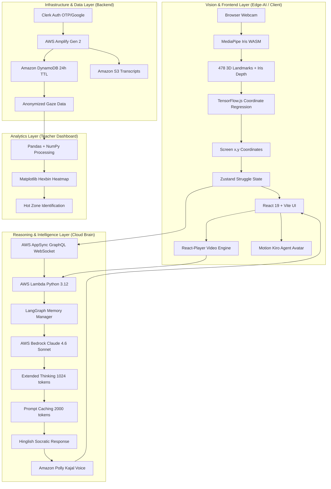
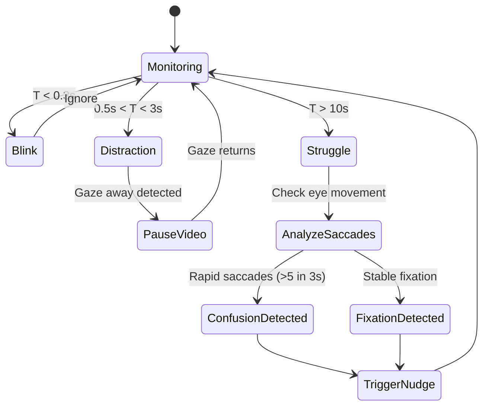
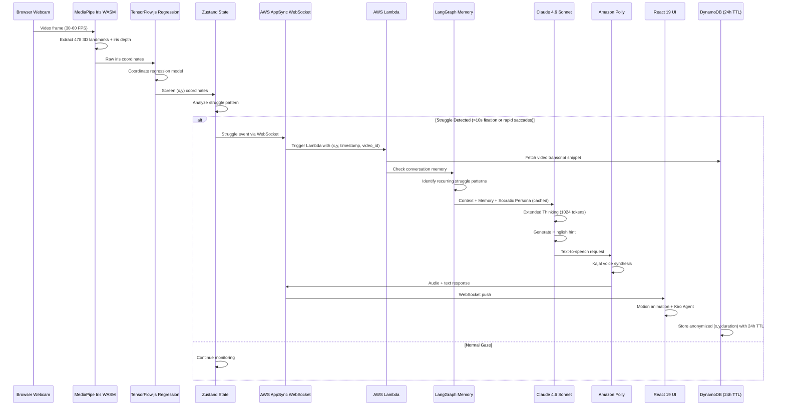
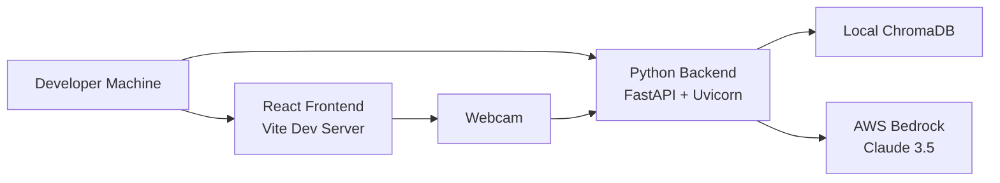
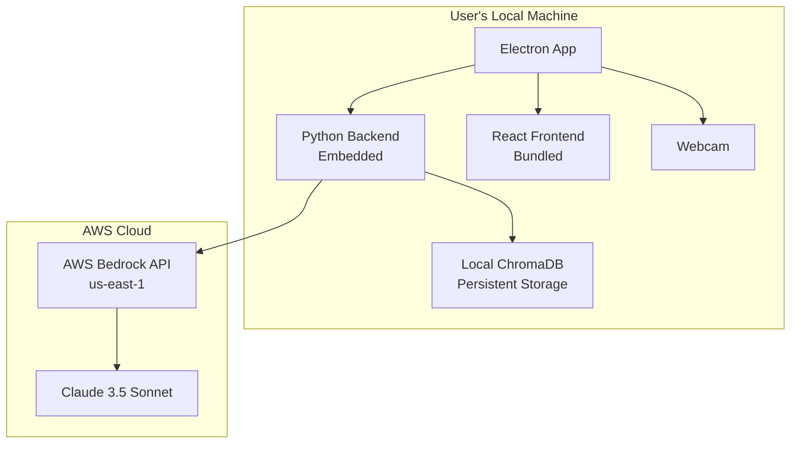

# Technical Design Document: A-Quire

## Overview

A-Quire is an AI-powered study assistant that uses real-time gaze tracking to detect student struggle and provide proactive tutoring in colloquial Hinglish. The system employs a 3-layer architecture: Perception Layer (MediaPipe-based gaze tracking), Contextual Layer (RAG with local study materials), and Interaction Layer (FastAPI backend with AWS Bedrock Claude 3.5 Sonnet).

The core innovation lies in the Struggle Detection Algorithm, which differentiates between physiological blinks (T < 0.3s), distractions (0.5s < T < 3s), and genuine conceptual struggle (T > 10s) using temporal buffer analysis and saccade vs. fixation patterns.

## System Architecture

### 4-Layer Architecture



### Layer Responsibilities

#### Vision & Frontend Layer (Edge-AI / Client)
- **Purpose**: Real-time eye tracking with zero latency and total privacy
- **Components**:
  - MediaPipe Iris (WASM): 478-point 3D facial landmark + iris depth detection
  - TensorFlow.js: Coordinate regression model mapping iris landmarks to screen (x,y)
  - Zustand: Global struggle state management (Confusion vs. Focus)
  - React 19 Compiler: Optimized rendering for high-frequency gaze data streams
  - Motion: Non-intrusive Kiro Agent avatar animations
  - React-Player: YouTube/Vimeo transcript synchronization
- **Performance Target**: 30-60 FPS on integrated graphics, < 50ms processing latency
- **Privacy**: 100% local processing in browser, zero biometric data transmission

#### Reasoning & Intelligence Layer (Cloud "Brain")
- **Purpose**: Socratic mentorship with advanced reasoning capabilities
- **Components**:
  - AWS Bedrock Claude 4.6 Sonnet: Extended Thinking (1024-token planning budget)
  - Prompt Caching: 2,000-token Socratic Persona cached for 90% cost reduction
  - AWS Lambda (Python 3.12): Serverless orchestration receiving gaze coordinates
  - LangGraph: Conversation memory tracking recurring struggle patterns
  - Amazon Polly (Kajal): Neural Hinglish voice synthesis
- **Performance Target**: < 3s end-to-end from struggle detection to hint generation
- **Cost Optimization**: Prompt caching + Extended Thinking for quality-cost balance

#### Infrastructure & Data Layer (Backend)
- **Purpose**: Scalable, secure, DPDP Act 2023 compliant infrastructure
- **Components**:
  - AWS AppSync (GraphQL): Real-time WebSocket API for instant communication
  - Amazon DynamoDB: Primary database with 24-hour TTL for automatic data deletion
  - Clerk: Passwordless authentication (OTP for Indian mobile, Google OAuth)
  - Amazon S3: JSON transcript storage for AI context retrieval
  - AWS Amplify Gen 2: GitHub-connected CI/CD pipeline
- **Performance Target**: < 100ms WebSocket latency for struggle events
- **Privacy**: Automatic biometric data deletion after 24 hours via DynamoDB TTL

#### Analytics Layer (Teacher's Dashboard)
- **Purpose**: Research insights for major project evaluation
- **Components**:
  - Pandas + NumPy: Anonymized gaze pattern data processing
  - Matplotlib/Seaborn: Hexbin heatmap visualization
  - Hot Zone Detection: Identifies video regions where multiple students struggle (>10s)
- **Performance Target**: Batch processing of session data for weekly reports
- **Privacy**: Only anonymized (x,y,duration) tuples, no student identification

## Struggle Detection Algorithm

### Temporal Classification Logic

The algorithm classifies gaze events based on temporal duration and spatial patterns:

```python
# Temporal thresholds
T_BLINK = 0.3      # seconds
T_DISTRACTION_MIN = 0.5
T_DISTRACTION_MAX = 3.0
T_STRUGGLE = 10.0   # seconds

# Spatial thresholds
FIXATION_RADIUS = 50  # pixels
SACCADE_VELOCITY_THRESHOLD = 300  # pixels/second
```

### Event Classification



### Saccades vs. Fixation Analysis

**Fixation Detection** (Indicates deep concentration on difficult content):
- Gaze remains within FIXATION_RADIUS (50 pixels) for duration T
- Low velocity: < 30 pixels/second
- Interpretation: Student is stuck on specific content
- Action: Trigger contextual explanation of current content

**Saccade Detection** (Indicates confusion or search behavior):
- Rapid eye movements between regions
- High velocity: > 300 pixels/second
- Pattern: > 5 saccades within 3 seconds
- Interpretation: Student is searching for related information
- Action: Trigger broader conceptual explanation

### Temporal Buffer Implementation

```python
class TemporalBuffer:
    """
    Stores gaze events with timestamps for pattern analysis.
    Buffer size: 30 seconds of history at 30 FPS = 900 frames
    """
    def __init__(self, buffer_duration=30.0, fps=30):
        self.buffer_duration = buffer_duration
        self.fps = fps
        self.max_frames = int(buffer_duration * fps)
        self.events = deque(maxlen=self.max_frames)
    
    def add_event(self, timestamp, gaze_x, gaze_y, event_type):
        """Add gaze event to buffer"""
        self.events.append({
            'timestamp': timestamp,
            'x': gaze_x,
            'y': gaze_y,
            'type': event_type
        })
    
    def detect_fixation(self, duration_threshold=10.0):
        """
        Detect if gaze has been fixated on same region
        for duration exceeding threshold
        """
        if len(self.events) < 2:
            return False, None
        
        current_time = self.events[-1]['timestamp']
        fixation_start = None
        fixation_point = None
        
        for event in reversed(self.events):
            time_diff = current_time - event['timestamp']
            if time_diff > duration_threshold:
                break
            
            if fixation_start is None:
                fixation_start = event
                fixation_point = (event['x'], event['y'])
                continue
            
            # Check if within fixation radius
            distance = math.sqrt(
                (event['x'] - fixation_point[0])**2 + 
                (event['y'] - fixation_point[1])**2
            )
            
            if distance > FIXATION_RADIUS:
                return False, None
        
        if fixation_start and (current_time - fixation_start['timestamp']) >= duration_threshold:
            return True, fixation_point
        
        return False, None
    
    def detect_saccades(self, time_window=3.0, min_saccades=5):
        """
        Detect rapid saccadic eye movements indicating confusion
        """
        if len(self.events) < 2:
            return False
        
        current_time = self.events[-1]['timestamp']
        saccade_count = 0
        prev_event = None
        
        for event in reversed(self.events):
            time_diff = current_time - event['timestamp']
            if time_diff > time_window:
                break
            
            if prev_event is not None:
                # Calculate velocity
                distance = math.sqrt(
                    (event['x'] - prev_event['x'])**2 + 
                    (event['y'] - prev_event['y'])**2
                )
                time_delta = prev_event['timestamp'] - event['timestamp']
                velocity = distance / time_delta if time_delta > 0 else 0
                
                if velocity > SACCADE_VELOCITY_THRESHOLD:
                    saccade_count += 1
            
            prev_event = event
        
        return saccade_count >= min_saccades
```

### Blink Detection and Filtering

```python
def is_physiological_blink(eye_closure_duration):
    """
    Filter out natural blinks from struggle detection
    """
    return eye_closure_duration < T_BLINK

def classify_gaze_event(temporal_buffer, current_event):
    """
    Main classification function
    """
    # Check for blink
    if current_event['type'] == 'eye_closed':
        if current_event['duration'] < T_BLINK:
            return 'BLINK_IGNORE'
    
    # Check for gaze away (distraction)
    if current_event['type'] == 'gaze_away':
        if T_DISTRACTION_MIN < current_event['duration'] < T_DISTRACTION_MAX:
            return 'DISTRACTION_PAUSE_VIDEO'
    
    # Check for struggle patterns
    is_fixated, fixation_point = temporal_buffer.detect_fixation(T_STRUGGLE)
    has_saccades = temporal_buffer.detect_saccades()
    
    if is_fixated:
        return 'STRUGGLE_FIXATION', fixation_point
    elif has_saccades:
        return 'STRUGGLE_CONFUSION', None
    
    return 'NORMAL', None
```

## Tech Stack

### 1. Vision & Frontend Layer (Edge-AI / Client)
This layer handles real-time eye tracking 100% locally in the browser for zero latency and total privacy.

- **React 19 + Vite 6.0**: Core framework with React Compiler for optimized rendering of high-frequency gaze data
- **TypeScript 5.x**: Strict typing for Landmark and Coordinate streams
- **MediaPipe Iris (WASM)**: Extracts 478 3D landmarks and iris depth at 30-60 FPS
- **TensorFlow.js 4.22+**: Maps raw 3D iris landmarks to precise screen (x,y) coordinates
- **Zustand 5.0**: State management for "Struggle State" (Confusion vs. Focus)
- **Tailwind CSS 4.0 + Shadcn UI**: Professional SaaS-grade interface
- **Motion (Framer Motion)**: Smooth "Kiro Agent" avatar transitions
- **React-Player**: Native hooks for YouTube and Vimeo transcript synchronization

### 2. Reasoning & Intelligence Layer (Cloud "Brain")
Socratic Mentorship logic powered by AWS Bedrock's most advanced reasoning models.

- **Claude 4.6 Sonnet (AWS Bedrock)**: 
  - Extended Thinking: 1024-token budget for AI to "plan" hints before responding
  - Prompt Caching: Caches 2,000-token "Socratic Persona" to reduce costs by 90%
- **AWS Lambda (Python 3.12)**: Serverless orchestration receiving (x,y) coordinates and triggering Claude
- **LangGraph (Python)**: Manages conversation memory to track recurring student struggles
- **Amazon Polly (Neural)**: Kajal (Hinglish) voice model for natural bilingual speech synthesis

### 3. Infrastructure & Data Layer (Backend)
Built for "Bharat" scale—low cost, high security, DPDP Act 2023 compliant.

- **AWS AppSync (GraphQL)**: Real-time WebSocket API for instant struggle-to-response communication
- **Amazon DynamoDB**: Primary database with 24-hour TTL for automatic biometric data deletion
- **Clerk**: Passwordless/OTP authentication optimized for Indian mobile numbers and Google accounts
- **Amazon S3**: Stores JSON-formatted video transcripts for AI context
- **AWS Amplify Gen 2**: CI/CD pipeline connected to GitHub for automatic builds

### 4. Analytics Layer (Teacher's Dashboard)
Research component for major project evaluation.

- **Pandas + NumPy (Python)**: Data processing for anonymized gaze patterns
- **Matplotlib / Seaborn**: Visualization for struggle heatmaps
- **Hexbin Heatmap Logic**: Overlays (x,y,duration) tuples on video frames to identify "Hot Zones"

### 5. Development & Observability Tools

- **Postman**: API testing for GraphQL and Bedrock endpoints
- **LangSmith**: Traces Claude's reasoning process for hint generation
- **GitHub**: Version control with Mermaid.js diagrams in README
- **Sentry**: Performance monitoring for cross-browser eye-tracking stability
- **GitBook**: Project documentation and thesis hosting

## Data Flow Diagram



### Detailed Data Flow Steps

1. **Gaze Capture** (Vision Layer - Browser):
   - Webcam captures frames at 30-60 FPS
   - MediaPipe Iris (WASM) processes each frame in < 16ms (60 FPS target)
   - Extracts 478 3D facial landmarks + iris depth
   - TensorFlow.js regression model maps iris coordinates to screen (x,y)
   - Zustand stores gaze coordinates in temporal buffer (last 30 seconds)

2. **Struggle Detection** (Vision Layer - Browser):
   - Every 100ms, analyze temporal buffer for patterns
   - Fixation detection: Gaze stayed in 50px radius for >10s
   - Confusion detection: >5 rapid saccades (>300 px/s) in 3s window
   - Blink filtering: Ignore eye closures <0.3s

3. **Real-time Communication** (Infrastructure Layer):
   - Struggle event sent via AWS AppSync WebSocket
   - Payload: `{x, y, timestamp, video_id, struggle_type}`
   - WebSocket ensures <100ms latency to Lambda

4. **Context Retrieval** (Reasoning Layer - AWS Lambda):
   - Lambda receives struggle event
   - Fetches video transcript snippet from S3 (±30s around timestamp)
   - Queries DynamoDB for student's conversation history
   - LangGraph analyzes memory for recurring struggle patterns

5. **AI Reasoning** (Reasoning Layer - Claude 4.6):
   - Constructs prompt with:
     - Cached Socratic Persona (2,000 tokens, 90% cost reduction)
     - Current video context (transcript snippet)
     - Conversation memory (recurring struggles)
     - Struggle type (fixation vs. confusion)
   - Extended Thinking: Claude uses 1024-token budget to "plan" response
   - Generates Hinglish hint in Socratic style

6. **Voice Synthesis** (Reasoning Layer - Amazon Polly):
   - Text response sent to Amazon Polly
   - Kajal (Neural Hinglish) voice model synthesizes audio
   - Returns audio URL + text transcript

7. **Nudge Display** (Vision Layer - React UI):
   - WebSocket pushes response to browser
   - Motion (Framer Motion) animates Kiro Agent avatar
   - Overlay fades in with audio playback
   - User can dismiss, bookmark, or request elaboration

8. **Privacy-First Storage** (Infrastructure Layer):
   - DynamoDB stores anonymized `(x,y,duration)` tuple
   - TTL set to 24 hours - automatic deletion
   - No raw video frames or biometric data stored
   - Only aggregated analytics retained for teacher dashboard

## Components and Interfaces

### MediaPipe Iris Tracker (WASM)

```typescript
interface IrisLandmarks {
  landmarks: Float32Array; // 478 3D points
  irisDepth: number;
  confidence: number;
  timestamp: number;
}

class MediaPipeIrisTracker {
  private vision: Vision;
  private faceLandmarker: FaceLandmarker;
  
  constructor() {
    this.vision = await FilesetResolver.forVisionTasks(
      "https://cdn.jsdelivr.net/npm/@mediapipe/tasks-vision/wasm"
    );
    this.faceLandmarker = await FaceLandmarker.createFromOptions(this.vision, {
      baseOptions: {
        modelAssetPath: "face_landmarker.task",
        delegate: "GPU"
      },
      numFaces: 1,
      refineLandmarks: true,
      minFaceDetectionConfidence: 0.5,
      minFacePresenceConfidence: 0.5,
      minTrackingConfidence: 0.5
    });
  }
  
  async detectLandmarks(videoFrame: HTMLVideoElement): Promise<IrisLandmarks> {
    const result = await this.faceLandmarker.detectForVideo(
      videoFrame,
      performance.now()
    );
    
    if (!result.faceLandmarks || result.faceLandmarks.length === 0) {
      throw new FaceNotDetectedError();
    }
    
    return {
      landmarks: result.faceLandmarks[0],
      irisDepth: this.calculateIrisDepth(result.faceLandmarks[0]),
      confidence: result.faceBlendshapes?.[0]?.score ?? 0,
      timestamp: performance.now()
    };
  }
  
  private calculateIrisDepth(landmarks: Float32Array): number {
    // Calculate iris depth from landmark distances
    // Used for accurate screen coordinate mapping
    const leftIris = landmarks.slice(468, 473);
    const rightIris = landmarks.slice(473, 478);
    return this.computeDepth(leftIris, rightIris);
  }
}
```

### TensorFlow.js Coordinate Regression

```typescript
interface ScreenCoordinates {
  x: number;
  y: number;
  confidence: number;
}

class GazeCoordinateRegressor {
  private model: tf.LayersModel;
  private calibrationMatrix: tf.Tensor2D | null = null;
  
  async loadModel(): Promise<void> {
    this.model = await tf.loadLayersModel('/models/gaze_regression/model.json');
  }
  
  async calibrate(calibrationPoints: CalibrationPoint[]): Promise<void> {
    // 5-point calibration: corners + center
    // Builds transformation matrix from iris landmarks to screen coords
    const inputs = calibrationPoints.map(p => p.irisLandmarks);
    const outputs = calibrationPoints.map(p => [p.screenX, p.screenY]);
    
    this.calibrationMatrix = this.computeCalibrationMatrix(inputs, outputs);
  }
  
  predictScreenCoordinates(landmarks: IrisLandmarks): ScreenCoordinates {
    if (!this.calibrationMatrix) {
      throw new CalibrationRequiredError();
    }
    
    const input = tf.tensor2d([landmarks.landmarks]);
    const prediction = this.model.predict(input) as tf.Tensor;
    const calibrated = tf.matMul(prediction, this.calibrationMatrix);
    
    const [x, y] = calibrated.dataSync();
    
    // Cleanup tensors
    input.dispose();
    prediction.dispose();
    calibrated.dispose();
    
    return {
      x: Math.round(x),
      y: Math.round(y),
      confidence: landmarks.confidence
    };
  }
}
```

### Zustand Struggle State Manager

```typescript
interface StruggleState {
  gazeHistory: GazeEvent[];
  currentStruggle: StruggleType | null;
  lastNudgeTime: number;
  isCalibrated: boolean;
}

type StruggleType = 'fixation' | 'confusion' | null;

interface GazeEvent {
  x: number;
  y: number;
  timestamp: number;
}

const useStruggleStore = create<StruggleState & Actions>((set, get) => ({
  gazeHistory: [],
  currentStruggle: null,
  lastNudgeTime: 0,
  isCalibrated: false,
  
  addGazeEvent: (event: GazeEvent) => {
    set(state => {
      const history = [...state.gazeHistory, event];
      // Keep only last 30 seconds (assuming 30 FPS = 900 frames)
      const cutoff = event.timestamp - 30000;
      const filtered = history.filter(e => e.timestamp > cutoff);
      
      return { gazeHistory: filtered };
    });
  },
  
  detectStruggle: () => {
    const { gazeHistory } = get();
    
    // Fixation detection: >10s in 50px radius
    const fixation = detectFixation(gazeHistory, 10000, 50);
    if (fixation) {
      set({ currentStruggle: 'fixation' });
      return 'fixation';
    }
    
    // Confusion detection: >5 rapid saccades in 3s
    const confusion = detectSaccades(gazeHistory, 3000, 5, 300);
    if (confusion) {
      set({ currentStruggle: 'confusion' });
      return 'confusion';
    }
    
    set({ currentStruggle: null });
    return null;
  },
  
  shouldTriggerNudge: () => {
    const { lastNudgeTime } = get();
    const cooldown = 60000; // 60 seconds
    return (Date.now() - lastNudgeTime) > cooldown;
  },
  
  markNudgeTriggered: () => {
    set({ lastNudgeTime: Date.now() });
  }
}));
```

### AWS Lambda Handler (Python 3.12)

```python
import json
import boto3
from langgraph.graph import StateGraph
from typing import TypedDict

bedrock = boto3.client('bedrock-runtime', region_name='us-east-1')
s3 = boto3.client('s3')
dynamodb = boto3.resource('dynamodb')

class StruggleEvent(TypedDict):
    x: int
    y: int
    timestamp: float
    video_id: str
    struggle_type: str
    student_id: str

async def lambda_handler(event, context):
    """
    Serverless orchestration for struggle detection to hint generation
    """
    struggle_event: StruggleEvent = json.loads(event['body'])
    
    # 1. Fetch video transcript snippet from S3
    transcript = fetch_transcript_snippet(
        struggle_event['video_id'],
        struggle_event['timestamp']
    )
    
    # 2. Retrieve conversation memory from DynamoDB
    memory = get_conversation_memory(struggle_event['student_id'])
    
    # 3. Build LangGraph state
    graph_state = {
        'transcript': transcript,
        'memory': memory,
        'struggle_type': struggle_event['struggle_type'],
        'coordinates': (struggle_event['x'], struggle_event['y'])
    }
    
    # 4. Execute LangGraph reasoning chain
    graph = build_reasoning_graph()
    result = await graph.ainvoke(graph_state)
    
    # 5. Generate Hinglish hint with Claude 4.6
    hint = await generate_hint_with_extended_thinking(result)
    
    # 6. Synthesize voice with Amazon Polly
    audio_url = synthesize_hinglish_voice(hint)
    
    # 7. Store anonymized data in DynamoDB (24h TTL)
    store_struggle_event(struggle_event)
    
    return {
        'statusCode': 200,
        'body': json.dumps({
            'hint_text': hint,
            'audio_url': audio_url,
            'timestamp': struggle_event['timestamp']
        })
    }

async def generate_hint_with_extended_thinking(context: dict) -> str:
    """
    Uses Claude 4.6 Sonnet with Extended Thinking and Prompt Caching
    """
    response = bedrock.invoke_model(
        modelId='anthropic.claude-4-6-sonnet-20250514',
        body=json.dumps({
            'anthropic_version': 'bedrock-2023-05-31',
            'max_tokens': 300,
            'thinking': {
                'type': 'enabled',
                'budget_tokens': 1024  # Extended Thinking budget
            },
            'system': [
                {
                    'type': 'text',
                    'text': SOCRATIC_PERSONA,  # 2000 tokens
                    'cache_control': {'type': 'ephemeral'}  # Prompt caching
                }
            ],
            'messages': [
                {
                    'role': 'user',
                    'content': build_struggle_prompt(context)
                }
            ]
        })
    )
    
    result = json.loads(response['body'].read())
    return result['content'][0]['text']
```

### LangGraph Memory Manager

```python
from langgraph.graph import StateGraph, END
from langgraph.checkpoint.memory import MemorySaver

class ConversationState(TypedDict):
    transcript: str
    memory: list[dict]
    struggle_type: str
    coordinates: tuple[int, int]
    recurring_struggles: list[str]
    hint: str

def build_reasoning_graph() -> StateGraph:
    """
    Manages conversation memory to track recurring struggles
    """
    workflow = StateGraph(ConversationState)
    
    workflow.add_node("analyze_memory", analyze_recurring_struggles)
    workflow.add_node("build_context", build_contextual_prompt)
    workflow.add_node("generate_hint", call_claude_with_caching)
    
    workflow.set_entry_point("analyze_memory")
    workflow.add_edge("analyze_memory", "build_context")
    workflow.add_edge("build_context", "generate_hint")
    workflow.add_edge("generate_hint", END)
    
    memory = MemorySaver()
    return workflow.compile(checkpointer=memory)

def analyze_recurring_struggles(state: ConversationState) -> ConversationState:
    """
    Identifies if student is repeatedly stuck on same concept
    """
    memory = state['memory']
    current_transcript = state['transcript']
    
    # Extract key concepts from past struggles
    past_concepts = [extract_concept(m['transcript']) for m in memory]
    current_concept = extract_concept(current_transcript)
    
    recurring = [c for c in past_concepts if similarity(c, current_concept) > 0.7]
    
    state['recurring_struggles'] = recurring
    return state
```

### Amazon Polly Voice Synthesis

```python
import boto3

polly = boto3.client('polly', region_name='ap-south-1')

def synthesize_hinglish_voice(text: str) -> str:
    """
    Uses Kajal (Neural Hinglish) voice model
    """
    response = polly.synthesize_speech(
        Text=text,
        OutputFormat='mp3',
        VoiceId='Kajal',  # Hinglish neural voice
        Engine='neural',
        LanguageCode='hi-IN'
    )
    
    # Upload to S3 and return presigned URL
    audio_stream = response['AudioStream'].read()
    audio_key = f"hints/{uuid.uuid4()}.mp3"
    
    s3.put_object(
        Bucket='a-quire-audio',
        Key=audio_key,
        Body=audio_stream,
        ContentType='audio/mpeg'
    )
    
    url = s3.generate_presigned_url(
        'get_object',
        Params={'Bucket': 'a-quire-audio', 'Key': audio_key},
        ExpiresIn=3600
    )
    
    return url
```

## Data Models

### Gaze Event Model

```python
from dataclasses import dataclass
from typing import Literal

@dataclass
class GazeEvent:
    timestamp: float
    gaze_x: int
    gaze_y: int
    confidence: float
    event_type: Literal['fixation', 'saccade', 'blink', 'gaze_away']
    duration: float
    metadata: dict
```

### Struggle Event Model

```python
@dataclass
class StruggleEvent:
    timestamp: float
    video_timestamp: float
    struggle_type: Literal['fixation', 'confusion']
    fixation_point: tuple[int, int] | None
    saccade_count: int
    context: str
    triggered_nudge: bool
```

### Study Material Chunk Model

```python
@dataclass
class StudyMaterialChunk:
    chunk_id: str
    document_name: str
    page_number: int
    text: str
    embedding: list[float]
    metadata: dict
```

### Nudge Model

```python
@dataclass
class Nudge:
    nudge_id: str
    timestamp: float
    video_timestamp: float
    content: str
    language: Literal['hinglish']
    retrieved_sources: list[str]
    user_action: Literal['dismissed', 'bookmarked', 'expanded', None]
    display_duration: float
```

### Session Model

```python
@dataclass
class StudySession:
    session_id: str
    start_time: float
    end_time: float
    video_url: str
    total_struggle_events: int
    total_nudges_shown: int
    nudges_dismissed: int
    struggle_timestamps: list[float]
    bookmarks: list[dict]
```

## Prompt Engineering Strategy

### System Persona for Claude 4.6 Sonnet (Cached)

The AI Tutor uses a 2,000-token Socratic Persona that is cached via Bedrock's Prompt Caching feature, reducing costs by 90% for repeated invocations.

```python
SOCRATIC_PERSONA = """
You are a patient Socratic mentor helping an Indian engineering student understand complex technical concepts. You speak in colloquial urban Hinglish - the natural code-switching between Hindi and English that students use daily.

CORE PHILOSOPHY - SOCRATIC METHOD:
- Never give direct answers immediately
- Ask guiding questions that lead to self-discovery
- Acknowledge struggle as part of learning: "Haan, yeh tricky hai, but let's think through it"
- Build on what they already know
- Use analogies from everyday Indian life

PERSONALITY:
- Supportive senior (bhaiya/didi), not a strict professor
- Warm and patient, never condescending
- Celebrate small breakthroughs: "Exactly! Ab connect ho gaya na?"
- Use casual language: "dekh", "samajh", "basically", "matlab"

LANGUAGE STYLE - HINGLISH CODE-SWITCHING:
- Hindi for connectors and emotions: "toh", "aur", "lekin", "kyunki", "arre"
- English for technical terms: "algorithm", "pointer", "recursion", "deadlock"
- Natural mixing: "Dekh, basically recursion ek function hai jo khud ko call karta hai"
- Keep sentences short and conversational (max 15 words per sentence)
- Use rhetorical questions: "Samajh aa raha hai na?"

TONE GUIDELINES:
- Warm and encouraging, never robotic
- Acknowledge difficulty: "Haan, yeh concept initially confusing lagta hai"
- Avoid formal phrases: ❌ "Let me help you" ✅ "Chal, saath mein dekhte hain"
- Never say "You seem confused" - too clinical
- Use inclusive language: "Hum saath mein solve karte hain"

SOCRATIC QUESTION PATTERNS:
1. Clarifying: "Toh basically, tu yeh samajh raha hai ki...?"
2. Probing assumptions: "Agar yeh true hai, toh kya hoga?"
3. Exploring alternatives: "Aur koi tarika ho sakta hai?"
4. Checking implications: "Iska matlab next step mein kya hoga?"

EXPLANATION STRUCTURE (Max 100 words):
1. Acknowledge struggle (1 sentence): "Haan, pointers initially tricky hote hain"
2. Ask guiding question (1 sentence): "Pehle yeh batao - variable memory mein kaise store hota hai?"
3. Give relatable analogy (2-3 sentences): "Dekh, phone number ki tarah hai. Number khud toh sirf digits hai, but usse tu kisi ko call kar sakta hai, right?"
4. Connect to their context (1 sentence): "Tere video mein bhi yahi concept hai"
5. Encourage next step (1 sentence): "Ab tu batao, pointer dereference karne pe kya milega?"

EXAMPLES OF GOOD HINGLISH:
✅ "Arre dekh, deadlock basically ek circular wait hai. Imagine do dost - ek ke paas pen, doosre ke paas notebook. Dono bol rahe 'pehle tu de'. Samajh aa gaya?"
✅ "Recursion thoda mind-bending hai initially. Chal, ek simple example lete hain - factorial. 5! matlab kya? 5 × 4 × 3 × 2 × 1, right? Ab isko recursively kaise likhenge?"
✅ "Pointers confusing lag rahe hain? No worries. Pehle yeh batao - agar int x = 10 hai, toh x memory mein kahan store hota hai? Address pe, na? Bas pointer wahi address store karta hai."

EXAMPLES OF BAD RESPONSES (AVOID):
❌ "It appears you are experiencing difficulty with this concept. Allow me to elucidate." (Too formal)
❌ "Let me explain pointers to you." (Not Socratic, too direct)
❌ "You seem confused about recursion." (Condescending)
❌ "Pointers are memory addresses that store locations." (Pure English, no Hinglish)

EXTENDED THINKING USAGE:
- Use your 1024-token thinking budget to:
  1. Analyze the student's struggle pattern (fixation vs. confusion)
  2. Identify the core misconception
  3. Choose the most relatable analogy from Indian context
  4. Craft a Socratic question that guides without revealing
  5. Ensure Hinglish code-switching feels natural

CONTEXT AWARENESS:
- If recurring struggle: "Dekh, yeh concept pehle bhi aaya tha. Kya woh wala part yaad hai?"
- If fixation (>10s): Focus on breaking down the specific stuck point
- If confusion (rapid saccades): Help connect scattered concepts

Remember: You're not a teacher lecturing - you're a helpful friend thinking through problems together over chai. Guide, don't tell.
"""
```

### Prompt Template for Struggle Fixation (Extended Thinking)

```python
FIXATION_PROMPT_TEMPLATE = """
CONTEXT:
The student has been fixated on this content for {duration} seconds, indicating they're stuck on a specific concept.

VIDEO TRANSCRIPT (±30s):
{transcript}

CONVERSATION MEMORY:
{memory}

STRUGGLE COORDINATES: ({x}, {y})
This suggests they're stuck on: {inferred_element}

TASK:
Using the Socratic method, help the student discover the answer themselves. Don't give the solution directly.

1. First, use your Extended Thinking to:
   - Identify the exact misconception
   - Choose a relatable Indian analogy
   - Craft a guiding question

2. Then, respond in natural Hinglish (max 100 words):
   - Acknowledge the difficulty briefly
   - Ask a Socratic question that guides them
   - Provide a hint through analogy if needed
   - Encourage them to think through the next step

Remember: Guide, don't tell. Make them feel capable of solving it.
"""
```

### Prompt Template for Confusion (Rapid Saccades)

```python
CONFUSION_PROMPT_TEMPLATE = """
CONTEXT:
The student's eyes moved rapidly {saccade_count} times in 3 seconds, suggesting they're trying to connect multiple concepts but feeling overwhelmed.

VIDEO TRANSCRIPT (±30s):
{transcript}

CONVERSATION MEMORY:
{memory}

GAZE PATTERN:
Rapid movements between: {gaze_regions}

TASK:
The student is trying to see the big picture but feels lost. Use Socratic method to help them connect the dots.

1. First, use your Extended Thinking to:
   - Identify which concepts they're trying to connect
   - Find the missing link in their understanding
   - Choose a unifying analogy

2. Then, respond in natural Hinglish (max 100 words):
   - Acknowledge their effort to connect concepts (positive!)
   - Ask a question that reveals the relationship
   - Use an analogy that shows how pieces fit together
   - Guide them to articulate the connection themselves

Remember: They're close to understanding - just need the right nudge to see the pattern.
"""
```

### Example Extended Thinking Process

**Input:**
- Duration: 12s fixation
- Transcript: "Deadlock occurs when two processes wait for each other's resources"
- Memory: Previously struggled with "mutual exclusion" concept
- Coordinates: (450, 320) - hovering over "wait for each other"

**Claude's Extended Thinking (Internal, 1024 tokens):**
```
<thinking>
The student is fixated on "wait for each other" for 12 seconds. This suggests they understand the words but not the circular dependency concept.

From memory, they struggled with "mutual exclusion" before, which means they might not grasp how multiple conditions combine to create deadlock.

Core misconception: They're thinking linearly (A waits for B, then B waits for A) rather than seeing the circular simultaneity.

Best analogy: Two people trying to pass through a narrow door - relatable, visual, shows simultaneity.

Socratic approach: Don't explain deadlock. Instead, ask them to imagine the door scenario and let them discover the "stuck" state themselves.

Hinglish construction:
- Start with acknowledgment: "Haan, yeh 'wait for each other' wala part tricky hai"
- Socratic question with analogy: "Ek kaam kar - imagine two people, narrow door. Dono ek saath enter karne ki koshish kar rahe hain. Kya hoga?"
- Guide to discovery: "Ab video mein jo 'wait for each other' likha hai, wahi situation hai na?"
- Encourage articulation: "Tu batao, yeh 'circular' kyun bol rahe hain?"

This guides them to discover circular dependency without telling them directly.
</thinking>
```

**Generated Hinglish Hint:**
```
Arre haan, yeh "wait for each other" wala part thoda tricky hai. Ek kaam kar - imagine two people trying to enter a narrow door at the same time. Dono ek saath ghusne ki koshish kar rahe hain. Kya hoga? Stuck ho jayenge, right? Ab video mein jo "wait for each other" likha hai, wahi situation hai. Tu batao, yeh "circular" kyun bol rahe hain? Kya dono processes ek doosre ka wait kar rahe hain simultaneously?
```

### Prompt Caching Configuration

```python
# Bedrock API call with prompt caching
response = bedrock.invoke_model(
    modelId='anthropic.claude-4-6-sonnet-20250514',
    body=json.dumps({
        'anthropic_version': 'bedrock-2023-05-31',
        'max_tokens': 300,
        'temperature': 0.7,
        'top_p': 0.9,
        'thinking': {
            'type': 'enabled',
            'budget_tokens': 1024  # Extended Thinking
        },
        'system': [
            {
                'type': 'text',
                'text': SOCRATIC_PERSONA,  # 2000 tokens
                'cache_control': {'type': 'ephemeral'}  # Cache this!
            }
        ],
        'messages': [
            {
                'role': 'user',
                'content': build_struggle_prompt(context)
            }
        ]
    })
)

# Cost savings:
# - Without caching: 2000 input tokens × $3/MTok = $0.006 per request
# - With caching: 2000 cached tokens × $0.30/MTok = $0.0006 per request
# - Savings: 90% reduction on system prompt
```

### Optimization Strategies

1. **Extended Thinking Budget Allocation**:
   - Fixation struggles: 1024 tokens (need deep analysis)
   - Confusion struggles: 768 tokens (pattern recognition)
   - Recurring struggles: 1024 tokens (memory analysis)

2. **Prompt Caching Layers**:
   - Layer 1 (Always cached): Socratic Persona (2000 tokens)
   - Layer 2 (Session cached): Video transcript (500-1000 tokens)
   - Layer 3 (Dynamic): Current struggle context (200-300 tokens)

3. **Temperature Settings**:
   - Temperature: 0.7 (balance between creativity and consistency)
   - Top-p: 0.9 (allow natural Hinglish variation)
   - Max tokens: 300 (enforce brevity for nudges)

4. **Quality Assurance**:
   - Track nudge dismissal rates per explanation style
   - A/B test Socratic vs. Direct explanation approaches
   - Monitor "Explain Later" bookmark rates (indicates timing issues)
   - Adjust Extended Thinking budget based on hint quality metrics

## Error Handling

### Gaze Tracking Errors

```python
class GazeTrackingError(Exception):
    """Base exception for gaze tracking failures"""
    pass

class CameraNotFoundError(GazeTrackingError):
    """Webcam not detected or accessible"""
    pass

class CalibrationFailedError(GazeTrackingError):
    """Calibration accuracy below threshold"""
    pass

class FaceNotDetectedError(GazeTrackingError):
    """No face detected in frame for > 2 seconds"""
    pass

# Error handling strategy
def handle_gaze_error(error):
    if isinstance(error, CameraNotFoundError):
        # Show UI message: "Please connect webcam"
        # Disable gaze features, allow manual video control
        pass
    elif isinstance(error, FaceNotDetectedError):
        # Pause video
        # Show UI message: "Please position yourself in front of camera"
        # Attempt reconnection every 1 second
        pass
    elif isinstance(error, CalibrationFailedError):
        # Prompt user to adjust lighting/camera position
        # Retry calibration up to 3 times
        # Fall back to reduced accuracy mode
        pass
```

### RAG Pipeline Errors

```python
class RAGError(Exception):
    """Base exception for RAG pipeline failures"""
    pass

class DocumentIndexingError(RAGError):
    """Failed to process and index document"""
    pass

class RetrievalError(RAGError):
    """Failed to retrieve relevant context"""
    pass

# Error handling strategy
def handle_rag_error(error, context):
    if isinstance(error, DocumentIndexingError):
        # Log error, notify user which document failed
        # Continue with other successfully indexed documents
        pass
    elif isinstance(error, RetrievalError):
        # Fall back to AI generation without retrieved context
        # Use only video context for explanation
        # Log retrieval failure for debugging
        pass
```

### AWS Bedrock Errors

```python
class AITutorError(Exception):
    """Base exception for AI tutor failures"""
    pass

class BedrockAPIError(AITutorError):
    """AWS Bedrock API call failed"""
    pass

class RateLimitError(AITutorError):
    """API rate limit exceeded"""
    pass

# Error handling strategy
def handle_ai_error(error, retry_count=0):
    if isinstance(error, RateLimitError):
        # Implement exponential backoff
        # Queue nudge for retry after cooldown
        # Show user: "Generating explanation..."
        pass
    elif isinstance(error, BedrockAPIError):
        if retry_count < 3:
            # Retry with exponential backoff
            time.sleep(2 ** retry_count)
            return retry_ai_generation()
        else:
            # Fall back to template-based explanation
            # Log failure for monitoring
            pass
```

### Video Player Errors

```python
class VideoPlayerError(Exception):
    """Base exception for video player failures"""
    pass

class VideoLoadError(VideoPlayerError):
    """Failed to load video file"""
    pass

class PlaybackError(VideoPlayerError):
    """Error during video playback"""
    pass

# Error handling strategy
def handle_video_error(error):
    if isinstance(error, VideoLoadError):
        # Show user-friendly error message
        # Suggest checking file format/codec
        # Disable gaze features until video loads
        pass
    elif isinstance(error, PlaybackError):
        # Attempt to resume from last known position
        # If fails, reload video
        # Preserve session data and bookmarks
        pass
```

## Testing Strategy

### Unit Testing

**Perception Layer Tests**:
- Test gaze coordinate estimation accuracy (< 50px error)
- Test blink detection (< 0.3s classification)
- Test calibration matrix computation
- Test head pose estimation

**Contextual Layer Tests**:
- Test temporal buffer operations (add, retrieve, analyze)
- Test fixation detection algorithm
- Test saccade counting algorithm
- Test RAG retrieval accuracy (relevance scoring)
- Test document chunking and embedding

**Interaction Layer Tests**:
- Test video pause/resume latency (< 100ms)
- Test nudge UI rendering and positioning
- Test session data persistence
- Test bookmark creation and retrieval

### Property-Based Testing

A property is a characteristic or behavior that should hold true across all valid executions of a system - essentially, a formal statement about what the system should do. Properties serve as the bridge between human-readable specifications and machine-verifiable correctness guarantees.

Before writing correctness properties, I need to analyze the acceptance criteria from the requirements document to determine which are testable as properties.


#### Property 1: Gaze-triggered video control latency
*For any* gaze away event lasting more than 0.5 seconds, the video player should pause within 100 milliseconds, and for any gaze return event, the video player should resume within 100 milliseconds.
**Validates: Requirements 1.1, 1.2**

#### Property 2: Auto-pause visual feedback
*For any* video pause triggered by gaze away detection, a visual indicator showing the pause reason should be displayed in the UI.
**Validates: Requirements 1.3**

#### Property 3: Blink filtering
*For any* physiological blink (duration < 0.3 seconds), the video player should continue playback without interruption and the struggle detector should not classify it as a struggle indicator.
**Validates: Requirements 1.4, 3.2**

#### Property 4: Manual pause disables auto-pause
*For any* manual pause action by the user, automatic pause functionality should be disabled until the user manually resumes playback.
**Validates: Requirements 1.5**

#### Property 5: Gaze coordinate accuracy
*For any* detected eye position with known ground truth, the gaze coordinates should be accurate within 50 pixels of the actual gaze point.
**Validates: Requirements 2.3**

#### Property 6: Eye detection failure handling
*For any* eye detection failure lasting more than 2 seconds, the system should pause the video and display a reconnection message.
**Validates: Requirements 2.5**

#### Property 7: Fixation classification
*For any* continuous gaze fixation on the same video region (within 50 pixel radius) for more than 10 seconds, the struggle detector should classify this as a struggle fixation.
**Validates: Requirements 3.1**

#### Property 8: Saccade-based confusion detection
*For any* gaze sequence containing more than 5 rapid movements (velocity > 300 px/s) between video regions within 3 seconds, the struggle detector should classify this as confusion and trigger help.
**Validates: Requirements 3.4**

#### Property 9: Struggle event logging
*For any* struggle pattern identified by the struggle detector, the system should create a timestamped bookmark in the session history with video context.
**Validates: Requirements 3.5, 9.2**

#### Property 10: Nudge positioning
*For any* nudge displayed by the system, the overlay should be positioned such that it does not obstruct the video content area or subtitle region.
**Validates: Requirements 4.3, 8.2**

#### Property 11: Adaptive nudge frequency
*For any* sequence of 3 consecutive nudge dismissals within 5 minutes, the system should reduce nudge frequency by 50% for the next 30 minutes.
**Validates: Requirements 8.3**

#### Property 12: AI context inclusion
*For any* AI tutor request, the prompt should include relevant context from the current video timestamp and transcript.
**Validates: Requirements 4.5**

#### Property 13: RAG content incorporation
*For any* AI explanation where the RAG engine retrieves relevant passages from study materials, the explanation should incorporate direct quotes or references from those passages.
**Validates: Requirements 5.3**

#### Property 14: PDF processing capability
*For any* PDF file up to 50MB in size, the RAG engine should successfully extract text content while preserving formatting.
**Validates: Requirements 5.5**

#### Property 15: Privacy - no gaze data transmission
*For any* data transmitted to external servers (AWS Bedrock), the payload should not contain raw gaze coordinates, eye images, or any personally identifiable gaze tracking data.
**Validates: Requirements 6.2, 6.3**

#### Property 16: Memory cleanup on exit
*For any* application closure event, all temporary gaze tracking data should be deleted from memory.
**Validates: Requirements 6.5**

#### Property 17: Bookmark creation for "Explain Later"
*For any* "Explain Later" action on a nudge, the system should create a bookmark at the current video timestamp without interrupting playback.
**Validates: Requirements 8.5**

#### Property 18: Session summary generation
*For any* completed study session, the system should generate a summary containing total study time, struggle points, and topics covered.
**Validates: Requirements 9.1**

#### Property 19: Session export functionality
*For any* study session in history, the system should allow export as a PDF report containing all session data.
**Validates: Requirements 9.4**

#### Property 20: Bookmark navigation
*For any* struggle bookmark clicked by the user, the system should navigate to that video timestamp and display the associated AI-generated explanation.
**Validates: Requirements 9.5**

#### Property 21: Calibration validation
*For any* completed calibration sequence, the system should validate accuracy by testing gaze detection on known points.
**Validates: Requirements 10.3**

#### Property 22: Calibration retry on low accuracy
*For any* calibration result with accuracy below 80%, the system should prompt the user to adjust camera position and offer recalibration.
**Validates: Requirements 10.4**

#### Property 23: Calibration profile persistence
*For any* user calibration session, the calibration profile should be saved and automatically loaded in future sessions for that user.
**Validates: Requirements 10.5**

### Integration Testing

**End-to-End Scenarios**:
1. Complete study session flow:
   - Start application → Calibrate → Load video → Study with gaze tracking → Receive nudges → End session → Review summary
   - Verify all components work together seamlessly
   - Measure end-to-end latency from struggle detection to nudge display

2. RAG pipeline integration:
   - Upload study materials → Index documents → Trigger struggle → Verify retrieved content appears in nudge
   - Test with various document types and sizes
   - Verify semantic relevance of retrieved passages

3. Privacy compliance:
   - Monitor all network traffic during session
   - Verify no gaze data transmitted to external servers
   - Verify local processing of all sensitive data

4. Error recovery:
   - Simulate camera disconnection during session
   - Simulate AWS Bedrock API failures
   - Verify graceful degradation and recovery

**Performance Testing**:
- Gaze processing latency: Measure frame-by-frame processing time
- Video pause/resume latency: Measure time from gaze event to video state change
- RAG retrieval latency: Measure time from query to retrieved results
- AI generation latency: Measure time from API call to response
- End-to-end latency: Measure complete struggle-to-nudge pipeline

**Load Testing**:
- Long study sessions (2+ hours): Verify no memory leaks or performance degradation
- Large document collections (100+ PDFs): Verify RAG performance remains acceptable
- Rapid gaze events: Verify system handles high-frequency gaze data without dropping frames

### Testing Configuration

**Property-Based Testing Library**: Hypothesis (Python)

**Test Configuration**:
```python
from hypothesis import given, settings, strategies as st

# Configure Hypothesis for thorough testing
@settings(max_examples=100, deadline=None)
@given(
    gaze_x=st.integers(min_value=0, max_value=1920),
    gaze_y=st.integers(min_value=0, max_value=1080),
    duration=st.floats(min_value=0.0, max_value=30.0)
)
def test_property_1_gaze_triggered_video_control(gaze_x, gaze_y, duration):
    """
    Feature: a-quire, Property 1: Gaze-triggered video control latency
    
    For any gaze away event lasting more than 0.5 seconds, the video player 
    should pause within 100 milliseconds, and for any gaze return event, 
    the video player should resume within 100 milliseconds.
    """
    # Test implementation
    pass
```

**Unit Test Framework**: Pytest

**Integration Test Framework**: Pytest with pytest-asyncio for async testing

**Performance Test Framework**: Locust for load testing, pytest-benchmark for micro-benchmarks

## Deployment Architecture

### Local Development



### Production Deployment



**Deployment Strategy**:
- Package as Electron app for cross-platform desktop support
- Embed Python backend using PyInstaller
- Bundle React frontend with Webpack
- Include MediaPipe and OpenCV binaries
- Local ChromaDB for vector storage (no cloud database)
- Only external dependency: AWS Bedrock API

**Installation Requirements**:
- Operating System: Windows 10+, macOS 11+, Ubuntu 20.04+
- RAM: 8GB minimum, 16GB recommended
- Storage: 2GB for application + space for study materials
- Webcam: 720p minimum, 1080p recommended
- Internet: Required for AWS Bedrock API calls only

## Security Considerations

### Data Privacy

1. **Local Processing**:
   - All gaze tracking data processed locally via MediaPipe
   - No raw gaze coordinates transmitted to external servers
   - Study materials remain on user's device

2. **API Communication**:
   - Only anonymized struggle events sent to AWS Bedrock
   - No personally identifiable information in API requests
   - TLS encryption for all API communication

3. **Data Retention**:
   - Gaze data stored in memory only during active session
   - Automatic cleanup on application exit
   - Session history stored locally with user control

### Authentication and Authorization

1. **AWS Credentials**:
   - User provides own AWS credentials for Bedrock access
   - Credentials stored securely using OS keychain
   - No credentials transmitted to third parties

2. **User Data**:
   - No user accounts or authentication required
   - All data stored locally on user's device
   - User has full control over data deletion

### Threat Model

**Threats Mitigated**:
- Gaze data interception: All processing local, no transmission
- Study material exposure: All documents stored locally
- Session history leakage: Local storage only

**Threats Not Mitigated** (Out of Scope):
- Physical access to user's device
- Malware on user's device
- AWS Bedrock API compromise

## Performance Optimization

### Gaze Processing Optimization

1. **Frame Rate Adaptation**:
   - Dynamically adjust processing frame rate based on CPU load
   - Reduce to 15 FPS if CPU usage > 80%
   - Maintain 30 FPS under normal conditions

2. **Efficient Landmark Detection**:
   - Use MediaPipe's refine_landmarks only when needed
   - Cache face mesh results for consecutive frames
   - Skip processing if face hasn't moved significantly

3. **Temporal Buffer Optimization**:
   - Use circular buffer to avoid memory reallocation
   - Implement efficient spatial indexing for fixation detection
   - Prune old events beyond 30-second window

### RAG Pipeline Optimization

1. **Document Chunking**:
   - Optimal chunk size: 500 tokens with 50 token overlap
   - Pre-compute embeddings during indexing
   - Cache frequently accessed chunks

2. **Vector Search**:
   - Use HNSW index in ChromaDB for fast similarity search
   - Limit search to top 3 results for speed
   - Implement query caching for repeated searches

3. **Embedding Model**:
   - Use lightweight model: all-MiniLM-L6-v2 (80MB)
   - Batch embed multiple chunks for efficiency
   - Cache embeddings to avoid recomputation

### AI Generation Optimization

1. **Prompt Optimization**:
   - Keep prompts under 2000 tokens
   - Truncate retrieved context if too long
   - Use streaming responses for faster perceived latency

2. **Caching**:
   - Cache AI responses for similar struggle patterns
   - Implement semantic similarity check before API call
   - Reuse explanations for identical video timestamps

3. **Rate Limiting**:
   - Implement cooldown period (60s) between nudges
   - Queue multiple struggle events and batch process
   - Prioritize fixation over confusion events

## Monitoring and Observability

### Metrics to Track

1. **Performance Metrics**:
   - Gaze processing latency (p50, p95, p99)
   - Video pause/resume latency
   - RAG retrieval time
   - AI generation time
   - End-to-end struggle-to-nudge latency

2. **Usage Metrics**:
   - Study session duration
   - Struggle events per session
   - Nudges shown per session
   - Nudge dismissal rate
   - Bookmark creation rate

3. **Quality Metrics**:
   - Gaze tracking accuracy
   - Calibration success rate
   - RAG retrieval relevance (user feedback)
   - AI explanation helpfulness (user feedback)

### Logging Strategy

```python
import logging
from datetime import datetime

# Configure structured logging
logging.basicConfig(
    level=logging.INFO,
    format='%(asctime)s - %(name)s - %(levelname)s - %(message)s',
    handlers=[
        logging.FileHandler('aquire.log'),
        logging.StreamHandler()
    ]
)

# Log categories
logger_gaze = logging.getLogger('aquire.gaze')
logger_struggle = logging.getLogger('aquire.struggle')
logger_rag = logging.getLogger('aquire.rag')
logger_ai = logging.getLogger('aquire.ai')

# Example log entries
logger_gaze.info(f"Gaze event: x={gaze_x}, y={gaze_y}, confidence={confidence}")
logger_struggle.info(f"Struggle detected: type={struggle_type}, timestamp={video_ts}")
logger_rag.info(f"Retrieved {len(docs)} documents in {retrieval_time}ms")
logger_ai.info(f"Generated nudge in {generation_time}ms, tokens={token_count}")
```

### Error Tracking

- Log all exceptions with full stack traces
- Track error rates by component
- Alert on critical errors (camera failure, API errors)
- Provide user-friendly error messages in UI

## Future Enhancements

### Phase 2 Features

1. **Multi-Modal Struggle Detection**:
   - Add facial expression analysis (confusion, frustration)
   - Incorporate mouse/keyboard activity patterns
   - Combine multiple signals for higher accuracy

2. **Adaptive Learning**:
   - Learn user's struggle patterns over time
   - Personalize nudge timing and content
   - Adjust thresholds based on user feedback

3. **Collaborative Features**:
   - Share study sessions with peers
   - Collaborative note-taking
   - Group study mode with multiple users

4. **Mobile Support**:
   - iOS/Android apps with front camera tracking
   - Optimized UI for smaller screens
   - Offline mode with sync

5. **Advanced Analytics**:
   - Learning progress tracking over time
   - Concept mastery visualization
   - Personalized study recommendations

### Technical Debt to Address

1. **Testing Coverage**:
   - Increase unit test coverage to 90%+
   - Add more integration tests for edge cases
   - Implement visual regression testing for UI

2. **Performance**:
   - Profile and optimize hot paths
   - Reduce memory footprint
   - Improve startup time

3. **Code Quality**:
   - Refactor large functions into smaller units
   - Improve error handling consistency
   - Add more type hints and documentation

## Conclusion

A-Quire's 3-layer architecture provides a robust foundation for real-time struggle detection and proactive tutoring. The Perception Layer ensures privacy-first gaze tracking with low latency, the Contextual Layer builds rich semantic understanding through RAG, and the Interaction Layer delivers empathetic Hinglish nudges that support learning without disruption.

The Struggle Detection Algorithm's temporal classification logic effectively differentiates between physiological blinks, distractions, and genuine conceptual struggle using saccade vs. fixation analysis. This enables precise, timely interventions that reduce cognitive load for students.

By processing all sensitive data locally and only transmitting anonymized context to AWS Bedrock, A-Quire maintains strong privacy guarantees while leveraging state-of-the-art AI for tutoring. The system's comprehensive testing strategy, including 23 correctness properties, ensures reliability and correctness across all components.
